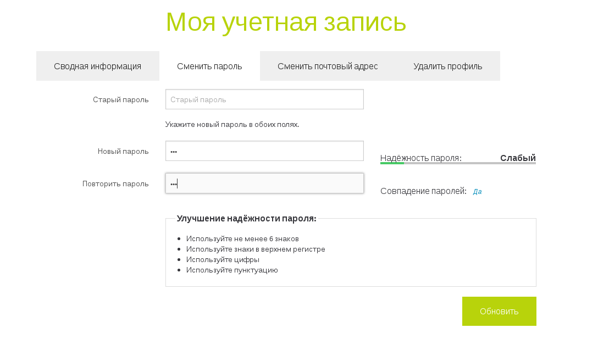

Angular password check
======================



##Usage

```

    app = angular.module('app', [
                'passwordCheck'
            ]
            
            
    <div class="row">
            <password-check
                    nickname="input#nickname"
                    password-input="input#password"
                    confirm-input="input#password_repeat"
                    password-recommendation="#pass-recommendation"
                    password-confirm-recommendation="#pass-confirm-recommendation"
                    strength-recommendation="#strength-recommendation"
                    auto_disable="true"
                    submit_button="button.submit_button"
                    >
            </password-check>
            <div class="col-lg-6">
                <div class="form-group">
                    <label for="password">password</label>
                    <input type="password" class="form-control" ng-model="user.u.password" id="password" placeholder="password" required>
                </div>
            </div>
            <div class="col-lg-6">
                <div id="pass-recommendation"></div>
            </div>
        </div>
        <div class="row">
            <div class="col-lg-6">
                <div class="form-group">
                    <label for="password_repeat">password repeat</label>
                    <input type="password" class="form-control" ng-model="user.u.password_repeat" id="password_repeat" placeholder="password repeat" required>
                </div>
            </div>
            <div id="pass-confirm-recommendation" class="col-lg-6">

            </div>
        </div>

        <div class="form-group">
            <div id="strength-recommendation"></div>
        </div>
    </div>

```

#### LICENSE

Angular-password-check is licensed under the [MIT License (MIT)](https://github.com/e154/angular-password-check/blob/master/LICENSE).
